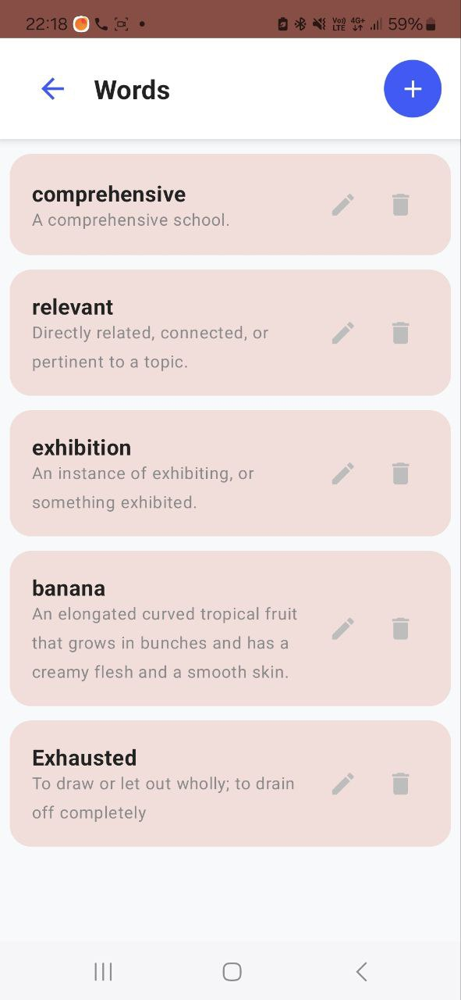
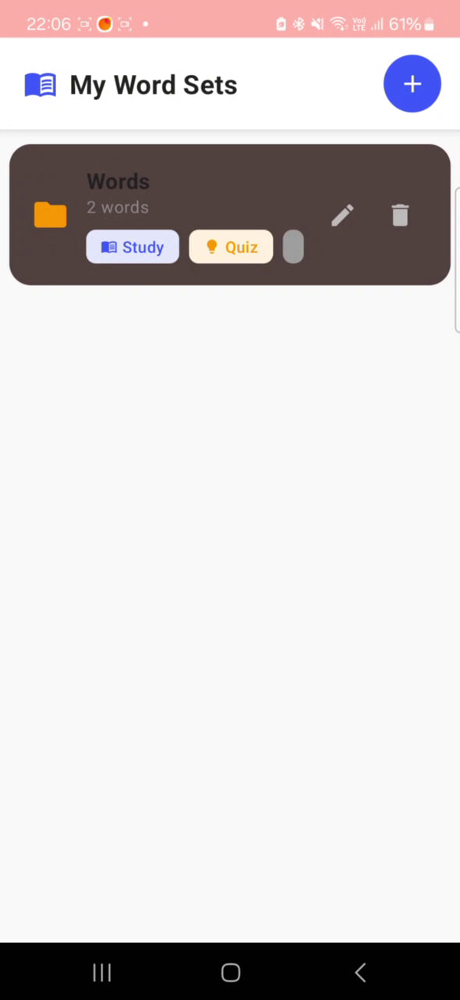
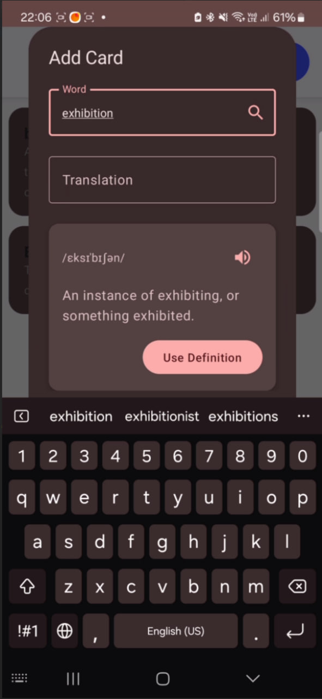
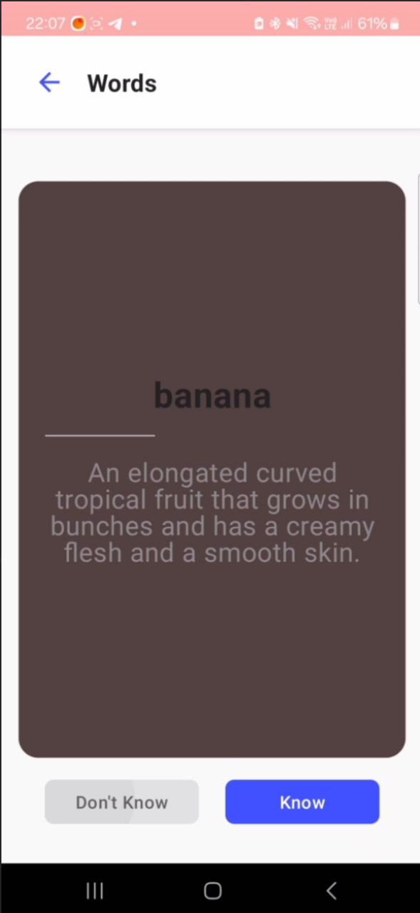
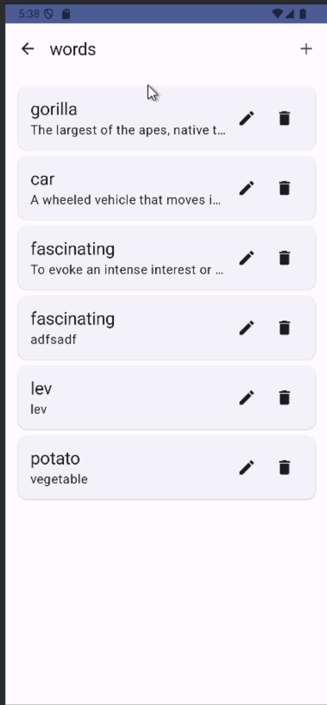
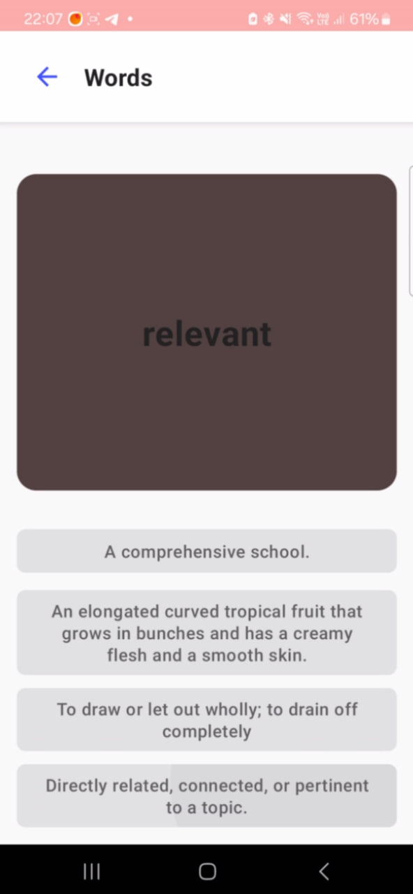

# 🚀 Project Name  
**English Study App** 😊

---

## Вариант: X
 - Лабораторная работа 8, БГУ, 2025г.

## 💡 Description  
Это мобильное приложение для изучения английских слов. Пользователь добавляет новые слова на английском, автоматически подтягиваются их значения из интернета, после чего можно запустить режим **«Study»**: показывается слово и описание, нужно отметить **«Know»** или **«Don’t Know»**. Так проходит серия карточек, что помогает запоминать новые слова.

---

## ⚙️ Installation  
1. 🛠️ Клонировать репозиторий:
   ```bash
   git clone git@github.com:yourusername/english-study-app.git
2. 📂 Открыть проект в Android Studio
3. ▶️ Нажать Run для сборки и запуска на устройстве или эмуляторе.

## 📱 Usage
1. В разделе Add Card ввести новое слово и нажать поиск – приложение подтянет транскрипцию и определение.

2. Нажать Use Definition, чтобы добавить карточку.

3. В разделе Words отобразятся все добавленные слова.

4. Нажать Study, чтобы пройти серию карточек: отмечать «Know» или «Don’t Know».

5. В конце работы получить статистику правильных ответов.


## 🤝 Contributing
### Исполнители:
- [**Кохан Даниил**](https://github.com/ExiDola):pray:- *DocWriter and spiritual support*
- [**Барановский Максим**](https://github.com/MaximBaranovskiy) :alien:- *App Coder*
- [**Соловьёв Даниил**](https://github.com/soldansd) :star:- *CI/CD and testing specialist* 

## Полезные ссылки:


## 📷 Screenshots
 1. 
 2. 
 3. 
 4. 
 5. 
 6. 

## 🎬 Video Demo
<video width="640" height="360" controls>
  <source src="./docs/demo_show.mp4" type="video/mp4">
  Ваш браузер не поддерживает видео тег.
</video>
